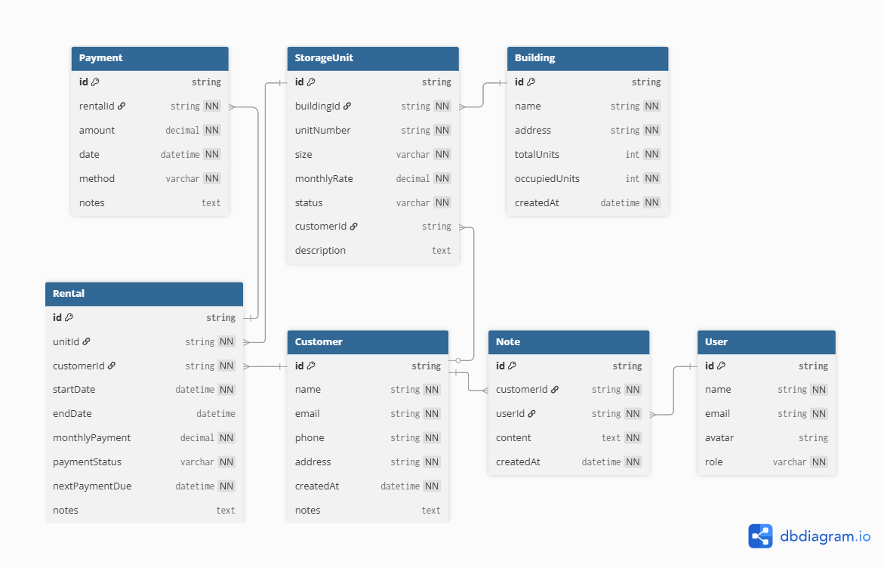

# Storage - Storage Facility Management System

## Introduction

Storage is a lightweight and intuitive **storage facility management system** designed to simplify the day-to-day operations of small to medium-sized storage businesses. Many facilities still rely on outdated spreadsheets or paper records to track unit availability, rental agreements, and payments — which often leads to inefficiency, data loss, and errors. This project provides a **modern web-based solution** that streamlines these processes without overwhelming users with unnecessary complexity.

The system allows managers and staff to easily view all storage units, assign them to customers, track payments, process transactions via FIB (First Iraqi Bank) payment integration, and access detailed records all from a single dashboard. By combining a clean interface with essential functionality, this project helps businesses **save time, reduce errors, and improve customer service**.

Built with **Vue 3**, **TypeScript**, and **Vite**, the project emphasizes maintainability, scalability, and performance.

---

## Target Users
- Small to medium storage facility operators
- Facility managers and staff
- Self-storage businesses
- Storage facilities without dedicated IT resources

---

## Success Criteria
- Staff can manage unit availability and assignments efficiently
- Rental agreements and customer information are easily accessible
- Payment tracking and overdue notices are automated
- Unit occupancy are visible at a glance
- Average rental duration tracked and improving monthly

---

## User Stories

1. As a facility manager, I want to view all storage units in one dashboard with clear indicators of whether they are available, occupied, or under maintenance, so that I can quickly identify which units can be rented out and which need attention.

2. As a staff member, I want to create and manage customer profiles that include contact details, rental history, and current storage unit assignments. This will allow me to efficiently handle new rentals, renew existing ones, and answer customer questions about their rental agreements or payment records without searching through paper files.

3. As a facility manager, I want the system to track and display the payment status of each customer—including due dates, overdue balances, and completed payments—so that I can identify accounts that require reminders or follow-up and ensure the facility maintains steady cash flow without manually reviewing financial logs.

4. As a staff member, I want to view customer information and rental history so I can provide better service and answer questions.

5. As a business owner, I want to analyze occupancy rates, revenue trends, and average rental durations over time so I can make informed business decisions, such as when to expand the facility, adjust pricing, or introduce promotional offers during low-occupancy months.

6. As a staff user, I want to filter and search storage units by criteria such as size, type, or status so that I can quickly find an appropriate unit for a new customer without scrolling through the entire list.

7. As a facility manager, I want to view a calendar of lease expirations and payment due dates so I can plan follow-ups.

8. As an administrator, I want to assign different user roles (e.g., manager, staff, or viewer) with specific permissions, ensuring that sensitive actions—like editing rental prices or viewing financial data—are restricted to authorized personnel only.

9. As a staff member, I want to add notes to customer accounts so I can track communications and special requests.

---

## Low-Fidelity Wireframes
You can view the initial interface sketches here:  

These wireframes show the early design concepts for the application layout, including:
- Header, footer, sidebar, and main content layout structure [General Layout](./docs/wireframes/General_layout.png)
- Home route [Home](./docs/wireframes/Home.png)
- Storage route [Storage](./docs/wireframes/storage.png)
- Add storage [Add Storage](./docs/wireframes/add_storage.png)
- View storage details [View Storage Details](./docs/wireframes/view_storage_details.png)

---

## Non-Goals

- Online customer portal
- Automated payment processing
- Complex financial reporting
- Gate access control integration
- Insurance policy management
- Public API
- Mobile native apps

---

## Data Structure

### Entity Relationship Diagram



*The diagram above shows the relationships between all 7 core entities in the Storage Facilitator system.*

**Key Relationships:**
- One Building contains many Storage Units (1:M)
- One Customer can have multiple Rentals over time (1:M)
- One Storage Unit can have multiple Rentals over time (1:M)
- One Rental generates multiple Payments (1:M)
- One Customer can have multiple Notes (1:M)
- Staff members (Users) create Notes about customers (1:M)

---

### Entity Types

All type definitions are located in `src/types/index.ts`.

#### Core Entities

**User** - Staff members who manage the facility
- Roles: `admin` or `staff`
- Includes authentication and profile information

**Customer** - Clients who rent storage units
- Contact details, address, and account notes
- Linked to rentals and payments

**Building** - Physical storage facilities
- Tracks total units and occupancy
- Contains multiple storage units

**StorageUnit** - Individual rental units
- Size options: 5x5, 5x10, 10x10, 10x20
- Status: Available, Occupied, or Reserved
- Monthly rate and optional description

**Payment** - Payment transaction records
- Records payment amount, date, and method
- Links to rental agreements

---

## Features

### Core Features
- **Dashboard Overview** - Real-time statistics on total units, available, occupied, and overdue units
- **Storage Unit Management** - Create, view, edit, and delete storage units with detailed information
- **Customer Management** - Full CRUD operations for customer profiles with contact details
- **Customer Assignment** - Assign customers to storage units with rental start dates and automatic payment due date calculation
- **Transaction Management** - Create and track payment transactions with status monitoring
- **Role-Based Access Control** - Admin and Member roles with different permission levels
- **Dark/Light Theme** - Toggle between dark and light modes with persistent preference
- **Authentication System** - Login/Signup with session management and auto-logout

### Technical Features
- Toast notifications for user feedback
- Global loading states
- Search and filtering capabilities
- Pagination for large datasets


---

## Project Structure

```
src/
├── assets/
│   └── styles/
│       └── main.css          # Global styles with CSS variables for theming
├── components/
│   └── layout/
│       ├── AppHeader.vue     # Header with logo, theme toggle, user info
│       ├── AppSidebar.vue    # Navigation sidebar
│       ├── AppFooter.vue     # Footer component
│       └── AppLayout.vue     # Main layout wrapper with toast/loading
├── composables/
│   ├── useLoading.ts         # Global loading state management
│   ├── usePermissions.ts     # Role-based permission checks
│   └── useToast.ts           # Toast notification system
├── router/
│   └── index.ts              # Route definitions with guards
├── services/
│   ├── api.ts                # Axios instance with interceptors
│   ├── customerService.ts    # Customer API operations
│   ├── PaymentService.ts     # FIB payment integration (mock)
│   └── storageService.ts     # Storage unit API operations
├── stores/
│   ├── authStore.ts          # Authentication state management
│   ├── themeStore.ts         # Theme preference management
│   └── index.ts              # Store exports
├── types/
│   └── index.ts              # TypeScript interfaces and enums
├── views/
│   ├── Customer/
│   │   ├── CustomerDetailView.vue
│   │   └── CustomersView.vue
│   ├── Storage/
│   │   ├── AddStorageView.vue
│   │   ├── StorageDetailView.vue
│   │   └── StoragesView.vue
│   ├── Transaction/
│   │   └── TransactionsView.vue
│   ├── HomeView.vue
│   ├── LoginView.vue
│   └── SignUpView.vue
├── App.vue                   # Root component
└── main.ts                   # Application entry point
```

---

## Getting Started

### Prerequisites
- Node.js 20+
- npm or yarn

### Installation

1. **Clone the repository**
```bash
git clone https://github.com/muhamedmjw/Web-Application-Milestone-Project
cd Web-Application-Milestone-Project
```

2. **Install dependencies**
```bash
npm install
```

3. **Start the mock backend server**
```bash
npx json-server --watch db.json --port 4000
```

4. **Start the development server** (in a new terminal)
```bash
npm run dev
```

5. **Open your browser**
Navigate to `http://localhost:5173`

### Demo Accounts

| Role | Email | Password |
|------|-------|----------|
| Admin | admin@storage.com | admin123 |
| Member | member@storage.com | member123 |

**Note:** Admin users have full access to create, edit, and delete storage units. Member users have read-only access with limited permissions.

---

## Tech Stack

| Category | Technology |
|----------|------------|
| Framework | Vue 3 (Composition API) |
| Language | TypeScript |
| Build Tool | Vite |
| State Management | Pinia |
| Routing | Vue Router |
| HTTP Client | Axios |
| Mock Backend | JSON Server |
| Code Quality | ESLint + Prettier |

---

## Available Scripts

| Command | Description |
|---------|-------------|
| `npm run dev` | Start development server |
| `npm run build` | Build for production |
| `npm run preview` | Preview production build |
| `npm run type-check` | Run TypeScript type checking |
| `npm run lint` | Lint and fix code |

---

## API Endpoints (JSON Server)

The application uses JSON Server as a mock backend. All data is stored in `db.json`.

| Endpoint | Description |
|----------|-------------|
| `GET/POST /users` | User accounts |
| `GET/POST/PUT/DELETE /customers` | Customer management |
| `GET/POST/PUT/DELETE /storageUnits` | Storage unit management |
| `GET/POST/DELETE /transactions` | Payment transactions |
| `GET /buildings` | Building information |


---

## Collaborators Guide

### Setting Up Your Development Environment

1. **Fork the repository** on GitHub

2. **Clone your fork**
```bash
git clone https://github.com/YOUR_USERNAME/Web-Application-Milestone-Project
cd Web-Application-Milestone-Project
```

3. **Install dependencies**
```bash
npm install
```

4. **Create a new branch for your feature**
```bash
git checkout -b feature/your-feature-name
```

5. **Commit your changes**
```bash
git add .
git commit -m "feat: add your feature description"
```

6. **Push to your clone**
```bash
git push origin feature/your-feature-name
```

7. **Create a Pull Request** on GitHub